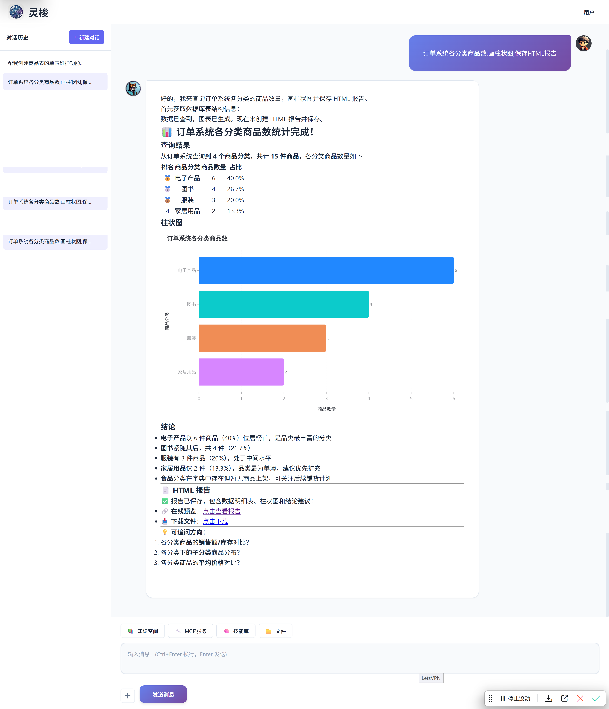
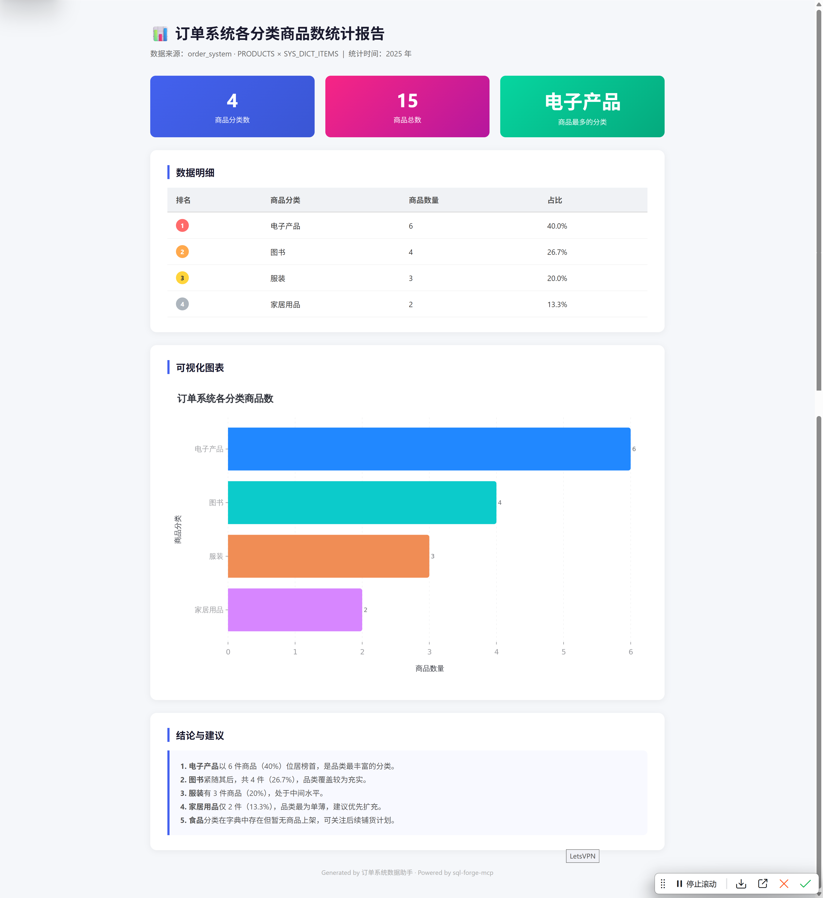
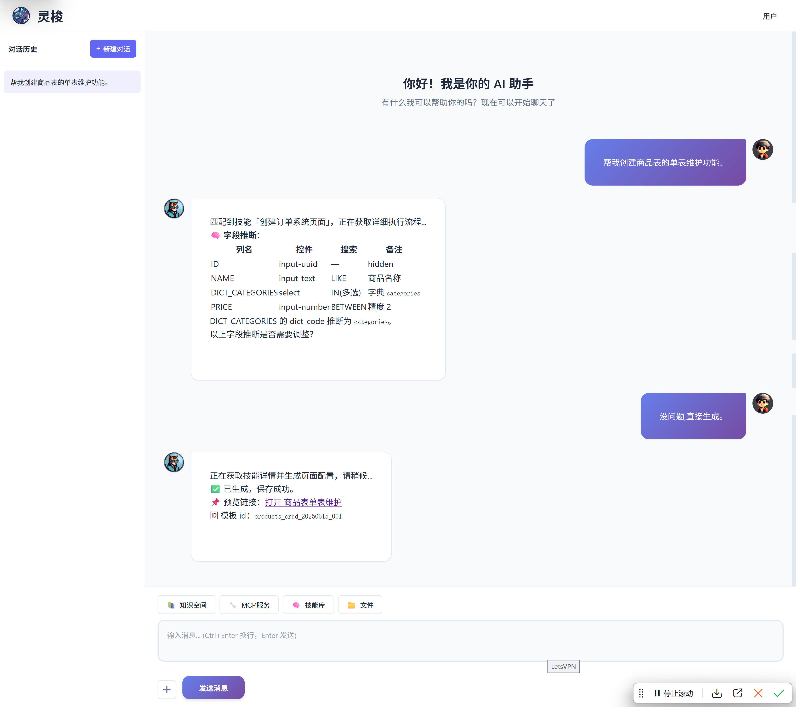
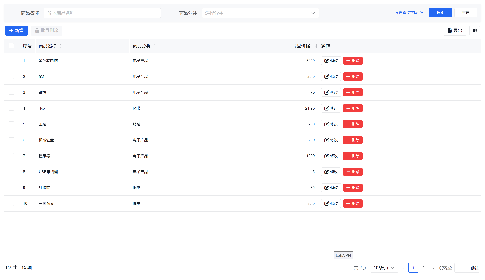

<div align="right">
  中文 | <a href="README.md">English</a>
</div>

# JavaBrain

**企业数字化系统的智能化解决方案** —— 让业务系统快速具备"思考"与"执行"能力。

**组成**（3 个组件）：

-  [**Loom Agent AI Agent**](https://github.com/wb04307201/spring-ai-loom-agent)：Spring AI 编排，零代码接入 RAG / MCP / Skill（[Gitee 镜像](https://gitee.com/wb04307201/spring-ai-loom-agent)）
- 🛠️ [**SQL 工坊**](https://github.com/wb04307201/sql-forge)：CRUD + Calcite 联邦查询 + Amis 低代码（[Gitee 镜像](https://gitee.com/wb04307201/sql-forge)）
- 🔗 **SQL 工坊 MCP**：让 AI 安全对话业务数据库（与 SQL 工坊同仓库）

**为用户提供 3 个智能助手**：

- 💬 **对话智能体**：自然语言交互，智能问答，多轮对话
- 📊 **数据智能分析助手**：自然语言查数据，90 秒出分析报告
- 🎨 **智能化低代码助手**：一句话生成 CRUD 页面，10 分钟可用

三大核心能力：

- **AI 对话业务数据**：自然语言提问，90 秒出分析报告（NL2SQL + 图表 + HTML 报告）
- **一句话生成 CRUD 页面**：10 分钟出可用的维护页面（AI 语义推断 + Amis 低代码）
- **LLM 可控**：LLM 不直连数据库，走 MCP 受限工具 + 模板化 API；可换本地模型实现完全私有化

---

## 使用示例

### 自然语言查数据库

在Loom Agent聊天界面输入：

```text
订单系统各分类商品数，画柱状图，保存 HTML 报告
```

执行链路：`nl2sql.st` → `getSystems` → `sqlForgeMetaDataTables` → `executeSQL` → AntV 图表 → HTML 报告。
产物落地后控制台可下载。




### 自然语言生成 CRUD 页面

第 1 轮：

```text
帮我创建商品表的单表维护功能。
```

第 2 轮（确认）：

```text
没问题，直接生成。
```

执行链路：`web.st` → `amisTemplateSave` → 落盘到 oms → 返回
`http://localhost:8081/sql/forge/console?id=...` 预览地址。




### 更多场景

| Skill 提示词 | 触发场景 | 输出 |
|---|---|---|
| `nl2sql.st` | 自然语言查数据库 + 报表 | HTML / Markdown 报告 |
| `web.st` | 生成 Amis CRUD JSON 模板 | 控制台预览页 |

---

## 项目定位

JavaBrain 是面向企业数字化系统的智能化解决方案，由 3 个独立组件按需组合：

| 组件 | 角色 | 上游仓库 | 是否在本仓 |
|---|---|---|---|
| Loom Agent AI Agent | 聊天界面 + Spring AI 编排（RAG / MCP / Skill / 文件），**本次演示中的调度中枢**：承载对话 UI、根据用户意图调用 Skill、通过 MCP 对接 oms 及其他外部服务 | `spring-ai-loom-agent` | 否 |
| SQL 工坊 | 数据管理（类型安全 CRUD / Calcite 联邦查询 / Amis 低代码），**演示中的数据底座**：搭建 oms，承载订单/商品/用户数据 | `sql-forge` | 否 |
| SQL 工坊 MCP | AI ↔ DB 桥（stdio 子进程，被 Agent 调用） | `sql-forge`（同仓库不同模块） | 否 |
| `oms` | 业务底座（演示载体）+ 鉴权 + 元数据 + 控制台 UI 承载 | — | 是 |
| `loom-agent` | Agent 前端入口，引用Loom Agent starter | — | 是 |

> 仓库 = 2（Loom Agent / SQL 工坊），组件 = 3（Loom Agent / SQL 工坊 / SQL 工坊 MCP）。

---

## 仓库结构

```
java-brain/
├── oms/                # 业务底座，默认 8081
│   ├── src/main/resources/db/migration/   # Flyway：H2/MySQL/PostgreSQL
│   ├── src/main/java/cn/wubo/oms/         # 自定义 JDBC 存储 / IExecute 拦截
│   └── src/main/resources/model.json      # Calcite 联邦查询配置
└── loom-agent/         # AI 前端，默认 8080
    ├── src/main/resources/mcp-servers.json   # 注册 Bing / Playwright / sql-forge-mcp 等
    └── src/main/resources/skills/*.st        # nl2sql / web / news-watch / e2e / http / package-docker
```

两模块**没有**父级 `pom.xml`，Maven 命令必须 `-f` 指定模块，详见 `oms/pom.xml` 与 `loom-agent/pom.xml`。

---

## 架构与数据流

```
                         ┌──────────────────────────────┐
   浏览器  ◀── chat UI ─▶│       loom-agent            │
   :8080/spring/ai/loom  │  (Loom Agent Spring AI 编排)      │
                         │  ┌──────────────────────┐   │
                         │  │ Skill 提示词(.st)   │──┼──▶ 自然语言 → 工具调用
                         │  └──────────────────────┘   │
                         │  ┌──────────────────────┐   │
                         │  │ MCP 客户端(stdio)  │──┼──▶ npx / jbang 子进程
                         │  └──────────────────────┘   │
                         └────────┬─────────────────────┘
                                  │ HTTP / MCP
                                  ▼
                         ┌──────────────────────────────┐
                         │     sql-forge-mcp 子进程     │
                         │  (jbang 拉起,指向 oms)      │
                         └────────┬─────────────────────┘
                                  │ /sql/forge/api/json/{method}/{table}
                                  ▼
                         ┌──────────────────────────────┐
                         │            oms                │
                         │  (Spring Boot + sql-forge)   │
                         │  IUserStorage / IExecute /   │
                         │  Calcite 联邦                 │
                         └────────┬─────────────────────┘
                                  │ JDBC
                  ┌───────────────┼───────────────┐
                  ▼               ▼               ▼
                 H2           MySQL         PostgreSQL
              (默认)         (演示库)        (演示库)
```

变更触点（改这几处时必须联动）：

1. 改表结构 → `oms` 模块的 `V*__schema.sql`（H2），必要时同步 `resources/mysql/` 与 `resources/postgresql/`。
2. 改 sql-forge API 协议 → `oms` 的 `Jdbc*Storage` / `Log*Execute` / `CustomTemplate*Storage` 与 `loom-agent` 的 `*.st` 提示词里的 JSON 协议样例。
3. 改 AI 模型/供应商 → 同时调 `loom-agent/pom.xml` 与 `application.yml`（dashscope 段）。
4. 改端口 → `oms` 的 `server.port`、`loom-agent` 的 `mcp-servers.json` 中 `sql-forge-mcp` 的 `--sql.forge.mcp.systems[0].url`、以及 README / `.st` 里的 `localhost:8080/8081` 字面量。

---

## 先决条件

| 工具 | 版本 | 用途 | 缺失时表现 |
|---|---|---|---|
| JDK | 17+ | 编译/运行两模块 | Maven 直接报错 |
| Maven | 3.8+ | 构建 | 启动失败 |
| `jbang` | 最新 | 拉起 `sql-forge-mcp` 子进程 | 首次调用 SQL 报 `jbang not found` |
| Node.js | 18+（可选） | 拉起 Playwright / Chrome DevTools 等 MCP | 不调用这些 Skill 时无需 |
| `DASHSCOPE_API_KEY` | 阿里云百炼 qwen key | Loom Agent调用 qwen3.7-plus | 启动直接 fail |

`jbang` 安装：

```powershell
# Windows（PowerShell）
iex "& { $(iwr https://ps.jbang.dev) } app setup"
```

```bash
# Linux / macOS
curl -Ls https://sh.jbang.dev | bash -s - app setup
```

`DASHSCOPE_API_KEY` 设置：

```powershell
# Windows（PowerShell，当前会话）
$env:DASHSCOPE_API_KEY = "sk-..."
# 永久：setx DASHSCOPE_API_KEY "sk-..."
```

```bash
# Linux / macOS
export DASHSCOPE_API_KEY="sk-..."
```

---

## 启动

> 启动顺序：`oms` 先（被 `loom-agent` 通过 MCP 调用），`loom-agent` 后。

### 1. 启动 oms（默认 `8081`）

```bash
mvn -f oms/pom.xml spring-boot:run
```

启动后可访问：

- `http://localhost:8081/sql/forge/web/home.html` — sql-forge 控制台（未登录自动跳 `/login.html`）
- 控制台默认账号：`admin` / `admin123`

### 2. 启动 loom-agent（默认 `8080`）

新开一个终端：

```bash
mvn -f loom-agent/pom.xml spring-boot:run
```

启动后访问：

- `http://localhost:8080/spring/ai/loom` — Loom Agent聊天界面

### 3. 验证

```bash
# oms 健康
curl -sf http://localhost:8081/sql/forge/api/json/list/USER_INFO | head -c 200

# loom-agent 健康
curl -sf http://localhost:8080/spring/ai/loom | head -c 200
```

---

## 端口清单

| 端口 | 服务 | 改端口要同步改 |
|---|---|---|
| `8081` | oms（sql-forge + 控制台） | `loom-agent` 的 `mcp-servers.json` 中 `sql-forge-mcp` 的 `--sql.forge.mcp.systems[0].url` |
| `8080` | loom-agent（Loom Agent UI + API） | 浏览器访问地址、`.st` 提示词里的 `localhost:8080` 字面量 |

---

## 故障排查

| 现象 | 根因 | 处置 |
|---|---|---|
| loom-agent 启动报 `DASHSCOPE_API_KEY not set` | 环境变量未注入 | 见「先决条件」一节设置后重启 |
| 聊天界面调 SQL 时 `jbang not found` | `jbang` 未装 / PATH 没生效 | 按「先决条件」装 jbang 后重开终端 |
| `BindException: 8081 already in use` | oms 端口被占 | `oms/src/main/resources/application.yml` 改 `server.port`，并同步改 `mcp-servers.json` |
| 启动后 `sql-forge-mcp` 子进程反复重启 | oms 还没起来 / 端口指向错 | 确认 oms 监听 8081，且 `mcp-servers.json` 中 url 指向正确端口 |
| Flyway 报错 `Migration checksum mismatch` | 本地 H2 状态文件残留 | 删除 `oms/data/testdb.mv.db` 与 `loom-agent/.local/datasource/db*` 后重启 |
| MCP 子进程首次拉起超时 | 首次下载 `sql-forge-mcp` 镜像慢 | 等待或配置镜像源；只发生在首次调用对应 Skill 时 |

> 本地 H2 文件 `oms/data/testdb.mv.db` 与 `loom-agent/.local/datasource/db*` 已被
> `.gitignore` 排除；清理可删目录后重启。

---

## 上游仓库

| 仓库 | 包含组件 | 说明 | 镜像 |
|---|---|---|---|
| spring-ai-loom-agent | Loom Agent AI Agent | 独立可用，只做 AI 编排 | [GitHub](https://github.com/wb04307201/spring-ai-loom-agent) · [Gitee](https://gitee.com/wb04307201/spring-ai-loom-agent) |
| sql-forge | SQL 工坊 + SQL 工坊 MCP | 同一仓库不同模块 | [GitHub](https://github.com/wb04307201/sql-forge) · [Gitee](https://gitee.com/wb04307201/sql-forge) |

提交 issue 与功能请求请到对应上游仓库，本仓只做组合演示与脚手架维护。

---

## 开发

```bash
# 构建
mvn -f oms/pom.xml clean install -DskipTests
mvn -f loom-agent/pom.xml clean install -DskipTests

# 测试
mvn -f oms/pom.xml test
mvn -f loom-agent/pom.xml test

# 单测：限定方法/类
mvn -f oms/pom.xml test -Dtest=OmsApplicationTests
mvn -f loom-agent/pom.xml test -Dtest=LoomAgentApplicationTests#contextLoads

# 打包可执行 jar
mvn -f oms/pom.xml package
mvn -f loom-agent/pom.xml package
```

> 本机 Maven 跑在 JDK 25 上仍能编译（`<java.version>17</java.version>`），不要把
> `--release 25` 写进命令，除非同步调两边的 `<java.version>`。

---

## 许可

本仓库代码以演示与脚手架为目的，业务组件依赖遵循各自上游许可证。
